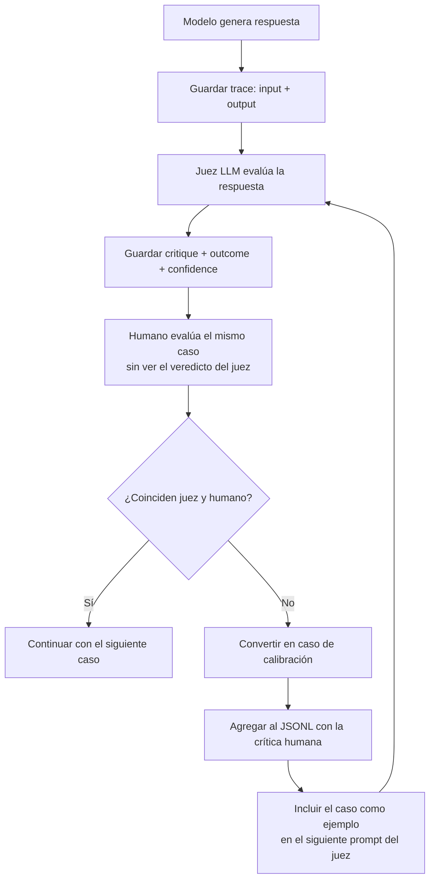

## Flujo de integración y evaluación

1. Modelo genera respuesta → guardar el trace (input + output)
2. Juez LLM evalúa esa respuesta → guardar critique + outcome + confidence
3. Humano evalúa el MISMO caso → SIN ver el veredicto del juez todavía
   (para no sesgarse)
4. Comparas juez vs. humano → ¿coinciden?
5. Si NO coinciden → ese caso se vuelve un "caso de calibración"
   → se agrega al JSONL con la crítica humana como explicación
6. El siguiente prompt del juez incluye ese caso como ejemplo

